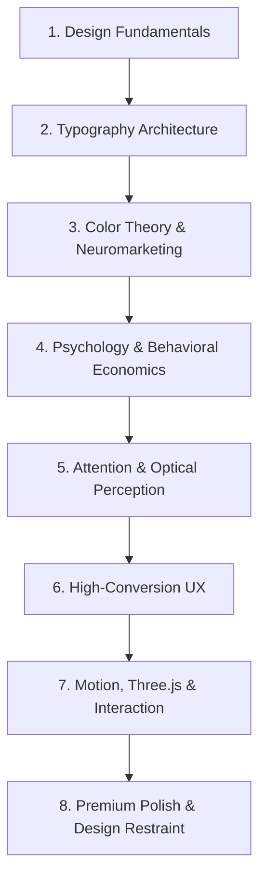

# MOBPIE // DESIGN & MOTION MASTERY CODEX (THE 8 DISCIPLINES & 100-SITE MOTION ATLAS)
> **Master Reference Document for High-Ticket Web Design, Neuromarketing, & Interactive 3D Engineering**
> *Created: September 2026 | Location: C:\Users\mobpi\.gemini\config\DESIGN_AND_MOTION_MASTERY_CODEX.md*

---

## 🏛️ PART I: THE 8 MASTER DISCIPLINES OF WORLD-CLASS DESIGN

---

### 1. DESIGN FUNDAMENTALS

#### A. Visual Hierarchy (The Rule of 3)
- **Concept**: The user's eye must never wonder what to look at first, second, or third.
- **Hierarchy Formula**:
  - **Level 1 (Primary Dominance)**: The single focal point of the viewport (Hero headline or 3D kinetic centerpiece). Visual weight: 60%.
  - **Level 2 (Secondary Structural)**: Navigation, key value propositions, primary CTA button. Visual weight: 30%.
  - **Level 3 (Tertiary Metadata)**: Technical telemetry, breadcrumbs, tags, timestamps, secondary links. Visual weight: 10%.
- **Implementation Rule**: If two competing elements have the same optical size and contrast, one must be systematically demoted using opacity (`rgba(..., 0.65)`), scale, or font weight.

#### B. Composition & Dynamic Balance
- **Golden Ratio & Asymmetric Balance**: Avoid static, dead-center symmetry for every section. Asymmetrical counter-balance (e.g., massive headline on the left counter-balanced by an interactive 3D kinetic engine on the right) creates visual kinetic energy and tension that keeps visitors engaged.
- **Rule of Thirds**: Position high-intent conversion anchors along the vertical 1/3 and 2/3 grid lines.

#### C. Layout & Grid Systems
- **12-Column Fluid Subgrid**: Use fluid containers with responsive margins (`padding: 0 clamp(1.25rem, 4vw, 3.5rem)`).
- **8pt Spatial Rhythm**: All margins, paddings, line-heights, and gap variables must strictly adhere to an 8px base unit system (8px, 16px, 24px, 32px, 48px, 64px, 96px, 128px) or 4px micro-increments.

#### D. Spacing & Macro vs. Micro Whitespace
- **Macro-Whitespace**: Generous breathing room between major acts (`padding: 8rem 0` to `10rem 0`). Allows executive brains to digest complex concepts without cognitive fatigue.
- **Micro-Whitespace**: Tightly tuned line-heights (`1.05` on display headers, `1.6–1.8` on body text) and padding within pills/buttons to maintain optical compactness.

#### E. Contrast (Scale, Tone & Texture)
- **Luminance Contrast**: WCAG AAA standard (minimum 7:1 ratio for text).
- **Scale Contrast**: Drastic scale jumps create immediate authority (e.g., jump from a 72px H1 directly to a 15px body copy, rather than incremental 32px -> 28px -> 24px clutter).
- **Texture Contrast**: Pair tactile film grain overlays (`0.035` opacity fractal noise) with ultra-smooth vector geometry and glowing 3D specular highlights.

#### F. Depth & Layering (Spatial Z-Axis Architecture)
- **Layer 0 (Void)**: Base background (`#07080a`).
- **Layer 1 (Atmospheric Ambient)**: Radial gradient glows (`rgba(212, 255, 0, 0.04)`) and tactile film grain.
- **Layer 2 (Canvas & 3D WebGL)**: Interactive Three.js kinetic core, particles, or ambient meshes.
- **Layer 3 (Glassmorphism & Cards)**: Elevated surfaces (`#14171f`) with hairline borders (`1px solid rgba(255, 255, 255, 0.08)`) and frosted backdrop blur (`backdrop-filter: blur(16px)`).
- **Layer 4 (Interactive UI & Text)**: Headlines, primary buttons, navigation HUD.
- **Layer 5 (HUD Overlays & Custom Cursor)**: Custom cursor dot, ring, and modal slide-outs (`z-index: 9999`).

---

### 2. TYPOGRAPHY ARCHITECTURE

#### A. Font Selection Principles
- **Display Fonts**: Must possess distinct character, muscular weight, and runway-grade presence (`Syne`, `Clash Display`, `Cabinet Grotesk`, `Italiana` for quiet luxury). Never use default system fonts or bland corporate sans for display titles.
- **Body Fonts**: Extreme legibility at 14–16px (`Space Grotesk`, `Plus Jakarta Sans`, `Inter`).
- **Telemetry / Mono Fonts**: Reserved strictly for technical data, coordinates, status badges, and code snippets (`JetBrains Mono`, `Space Mono`).

#### B. Font Pairing Formula (The Tension Rule)
- Always pair fonts with intentional contrast:
  - *Muscular Neo-Grotesk Display (`Syne` 800)* + *Technical Clean Body (`Space Grotesk` 400)* + *Precision Telemetry (`JetBrains Mono` 500)*.
  - *Haute Couture Editorial Serif (`Italiana` / `Instrument Serif`)* + *Surgical Modern Sans (`Plus Jakarta Sans`)*.
- **Strict Limit**: Maximum 2 primary font families per website + 1 monospaced font for telemetry.

#### C. Optical Type Scaling & Spacing
- **Display Headlines**:
  - `font-size: clamp(2.4rem, 5vw, 5.2rem);`
  - `line-height: 1.02–1.08;`
  - `letter-spacing: -0.02em to -0.03em;` (Negative tracking prevents words from feeling loose or fragmented at large scales).
- **Body Text**:
  - `font-size: clamp(0.95rem, 1.2vw, 1.1rem);`
  - `line-height: 1.65–1.8;`
  - `letter-spacing: 0.01em;`
- **Metadata / Badges / Kicker Uppercase**:
  - `font-size: 0.58rem–0.72rem;`
  - `letter-spacing: 0.14em–0.22em;` (Wide tracking ensures small uppercase text is instantly readable).

---

### 3. COLOR THEORY & NEUROMARKETING

#### A. The 60-30-10 Neuromarketing Ratio
- **60% (Canvas Dominance)**: Deep Void Graphite (`#07080a`) or Velvet Onyx (`#0e1014`). Provides zero eye strain and creates infinite perceived depth.
- **30% (Structural Hierarchy)**: Elevated dark surfaces (`#14171f`), hairline borders (`rgba(255, 255, 255, 0.08)`), muted slate copy (`#8a90a2`).
- **10% (High-Voltage Accent)**: The singular action color (Electric Acid Volt `#d4ff00`, Hyper Vermilion `#ff3b00`, or Cashmere Champagne `#dfcfb3`). Used exclusively for CTAs, active states, key metric highlights, and cursor glow.

#### B. Anti-AI Slop Color Rules
- 🚫 **BANNED**: Generic purple/indigo Tailwind gradients (`#8a2be2`, `#6366f1`).
- 🚫 **BANNED**: Muddy brassy casino gold (`#d4af37` on dark black looks like rust).
- ✅ **APPROVED LUXURY**: Cashmere Champagne Silk (`#dfcfb3` / `#ece3cf`).
- ✅ **APPROVED KINETIC POWER**: Electric Acid Volt (`#d4ff00` / `#ccff00`).
- ✅ **APPROVED HIGH-SPEED RACING**: Hyper-Vermilion Red Bull Orange (`#ff3b00`).
- ✅ **APPROVED BIOLUMINESCENT TECH**: Signal Cyan (`#00f0ff`).

---

### 4. PSYCHOLOGY & BEHAVIORAL ECONOMICS

#### A. Gestalt Principles in UI
1. **Proximity**: Elements belonging to the same capability must be clustered inside a unified surface with tighter internal gap (`0.5rem`) than the external grid margin (`2rem`).
2. **Similarity**: Interactive modules must share identical border-radii, typography weights, and hover states to communicate equal functional affordance.
3. **Closure**: A partial horizontal card bleed off-screen immediately signals horizontal swipeability to the human brain without needing an explanatory label.
4. **Figure-Ground**: Cards must clearly rise off the dark void using diffuse drop-shadows (`box-shadow: 0 20px 50px rgba(0, 0, 0, 0.7)`) and subtle border luminescence.

#### B. Core Behavioral Laws
- **Hick’s Law**: More choices = slower decision time. Limit primary hero actions to at most TWO: one high-intent primary CTA (`COMMISSION 72H SPRINT`) and one exploration secondary CTA (`INSPECT WEAPONS`).
- **Fitts’s Law**: Interactive targets must have large hitboxes (minimum 44px height) and be placed in natural eye-flow paths. On mobile, sticky bottom dock navigation places critical tabs directly under the user's thumb.
- **Von Restorff Effect (Isolation Effect)**: When multiple items are presented, the one that visually breaks the pattern is remembered best. (e.g., highlighting the "72H Staging Prototype" in Electric Volt while other options remain subtle).
- **Jakob’s Law**: Don't reinvent familiar ergonomics. Users expect the brand logo at the top left to return home, and communication hotlines at the top right.
- **Cognitive Load Minimization**: Strip out all decorative fluff that doesn't advance trust or explain the product.
- **Aesthetic-Usability Effect**: Interfaces that look exceptionally polished and world-class are perceived by founders and investors as more technically capable, faster, and more trustworthy.
- **Serial Position Effect**: Founders recall the Hero Hook (first impression) and the VIP Concierge / Guarantee (final impression) best. These two acts must carry the highest visual punch.
- **Recognition vs. Recall**: Never make users guess what to write in an empty text box. Provide clickable capability cards and preset sprint pills so they configure their brief with single clicks.

---

### 5. ATTENTION & OPTICAL PERCEPTION

#### A. Focal Point Engineering
- Every viewport must have exactly ONE dominant visual beacon. In the Hero, it is the kinetic 3D engine and the primary headline. Never let 5 badges compete for equal attention.

#### B. Visual Scanning Dynamics (Z-Pattern & F-Pattern)
- **Z-Pattern (Landing Viewport)**:
  1. Top-Left: Brand Monogram & Stature.
  2. Top-Right: Telemetry Status & VIP Hotline.
  3. Center-Left: Commanding Display Headline & Value Proposition.
  4. Bottom-Left / Center: Primary Conversion Trigger.
- **F-Pattern (Detailed Scannable Blocks)**:
  - In the Guerilla Moat Matrix and Case Studies, keep the feature names pinned to the left edge with bold optical weight so founders can scan vertically in 2 seconds.

---

### 6. HIGH-CONVERSION UX ARCHITECTURE

#### A. The High-Ticket Founder Conversion Flow
1. **Hook (Act 01)**: Relentless positioning, undeniable speed, live telemetry.
2. **Proof (Act 02)**: Real interactive production flagships (Atelier Ora 3D Garment Studio, Amazon Atelier). Zero mockups.
3. **The Moat (Act 03)**: Unapologetic breakdown of why commodity agencies fail and why Mobpie's bare-metal architecture wins.
4. **The Pedigree (Act 04)**: The founder's manifesto, studio base, and strict partnership limits (1–2 clients/month).
5. **The Spec Lab (Act 05)**: Interactive, tactile configurator that generates a customized project brief.
6. **The Protocol (Act 06)**: Clear 72-hour staging milestone with zero upfront financial risk.
7. **Direct Comms (Act 07)**: Skip agency gatekeepers with a direct 1-click WhatsApp VIP hotline.

#### B. Affordance & Feedback Loop
- Every clickable item must provide immediate multimodal feedback:
  - Optical: Background tint shifts, border illuminates in Electric Volt, card elevates by 2–4px.
  - Haptic / Acoustic: Web Audio API synthesized 12ms micro-click.

---

### 7. MOTION, THREE.JS & INTERACTION DESIGN

#### A. The Physics of UI Motion
- **No Linear Motion**: Linear animations (`linear`) feel robotic and unnatural. Always use tailored cubic-bezier easing curves:
  - `var(--spring-snappy): 380ms cubic-bezier(0.34, 1.56, 0.64, 1);` (for buttons, toggle pills, and hover pops).
  - `var(--spring-gentle): 480ms cubic-bezier(0.22, 1, 0.36, 1);` (for drawer slides, tab switches).
  - `var(--ease-out-expo): 600ms cubic-bezier(0.16, 1, 0.3, 1);` (for smooth opacity and reveal wipes).

#### B. Low-End PC Hardware Safeguards
- **IntersectionObserver Loop Pause**: Three.js `requestAnimationFrame` MUST be paused when the 3D canvas is outside the active viewport. This drops GPU and CPU consumption to zero while the user reads lower sections.
- **Pixel Ratio Clamping**: `renderer.setPixelRatio(Math.min(window.devicePixelRatio || 1, 2));` (Never render at 3x on ultra-high DPI mobile screens; 2x is visually identical and saves 50% GPU fill rate).
- **Pure Web Audio API**: Never load heavy audio sound files for micro-interactions. Synthesize clean square/sine wave micro-clicks at runtime with 0kb network payload.

---

### 8. PREMIUM DESIGN & THE "PAY WITHOUT THINKING" POLISH

- **Design Restraint**: A true master uses the minimum number of effects necessary to create maximum impact. Never pile on 10 random animations just because they look cool. Every animation must guide attention or provide state feedback.
- **Micro-Details**:
  - Custom scrollbar matching the dark void.
  - Hairline borders with semi-transparent alphas (`rgba(255, 255, 255, 0.08)`).
  - Negative margins tuned to eliminate awkward gaps.
  - Text selection styled with brand accent (`::selection { background: var(--accent-volt); color: #000; }`).

---

## 🚀 PART II: THE MOTIONSITES.AI 100-SITE MOTION & 3D ATLAS

Based on research of **MotionSites.ai**, **DesignRocket.io**, and award-winning Awwwards SOTY winners (such as *Lando Norris by OFF+BRAND*, *Slosh Seltzer by Active Theory*, and *Basement Studio*), here are the core interactive motion archetypes:

### 1. The Kinetic Faceted Polyhedral Core (EMBER / Digital Epoch Archetype)
- **Visuals**: Low-poly Icosahedron or Octahedron with metallic physical materials, high clearcoat, and glowing wireframe outer shell.
- **Motion**:
  - Continuous gyroscopic rotation with friction decay on mouse release.
  - Vertex shader wave displacement that ripples dynamically based on mouse velocity (`uVelocity`).
  - Pulsing breathing expansion synchronized with clock elapsed time.
- **Usage**: Perfect for tech flagships, crypto/DeFi protocols, and AI developer studios.

### 2. The Liquid Mercury Fluid Environment (Slosh Seltzer / Active Theory Archetype)
- **Visuals**: High-specular reflective sphere or torus with studio HDRI environment mapping and ACES filmic tone mapping.
- **Motion**: GPU vertex noise displacing the surface to mimic turbulent liquid chrome, reacting to cursor drag.
- **Usage**: Haute-couture apparel, luxury fragrances, and high-ticket consumer goods.

### 3. The Gyroscopic Astrolabe Engine (NOVA Space / Aethel Horology Archetype)
- **Visuals**: Concentric metallic rings rotating along independent 3-dimensional axes (X, Y, Z) with laser-etched tick markers.
- **Motion**: Counter-rotational harmonic oscillation (`sin(time * speed)`).
- **Usage**: High horology, aerospace, precision engineering, and enterprise cloud architecture.

### 4. The Particle Gravity Swarm (RIVR / AI Agent Archetype)
- **Visuals**: Hundreds of luminous point particles orbiting a central point with additive blending (`THREE.AdditiveBlending`).
- **Motion**: Particles swirl in a vortex; when user moves cursor, particles accelerate toward the cursor coordinates with smooth dampening.
- **Usage**: AI platforms, data intelligence, cybersecurity, and real-time networks.

### 5. The Dennis Snellenberg Magnetic Cursor & Fluid Buttons
- **Visuals**: Custom circular cursor ring following a precision center dot with spring interpolation.
- **Motion**:
  - When cursor approaches within 40px of a CTA button, the button magnetically pulls toward the cursor position (`deltaX * 0.28, deltaY * 0.28`).
  - On hover over visual case study cards, the cursor ring smoothly scales up from 32px to 74px and reveals a bold label: `DRAG` or `VIEW`.
- **Usage**: Agency portfolios, creative developer studios, and luxury e-commerce.

### 6. The Pinned Multi-View Holodeck (Locomotive / Build in Amsterdam Archetype)
- **Visuals**: Single viewport with an interactive mode selector (e.g., *Flagship Storefront* vs *Bespoke Logistics ERP*).
- **Motion**: Smooth cross-fade or wipe transition between live states without reloading the page.
- **Usage**: Complex digital products, B2B SaaS platforms with both consumer storefront and founder backoffice.

### 7. The Guerilla Moat Benchmark Matrix
- **Visuals**: High-contrast, tabular comparison separating cheap commodity agency output from bespoke handcrafted architecture.
- **Motion**: Hovering over rows highlights the Mobpie column in glowing Electric Volt while dimming the competitor column.
- **Usage**: Founder-facing service conversion, high-ticket agency sales pages.

### 8. The Scroll-Scrubbed Canvas Exploder
- **Visuals**: High-resolution 3D model or image sequence rendered to a `<canvas>` element.
- **Motion**: As user scrolls down the page, the camera orbits 360 degrees around the product while internal components separate (exploded CAD view).
- **Usage**: Physical luxury hardware, timepieces, automotive, and flagship electronics.

---

## ⚡ SUMMARY CHECKLIST FOR EVERY MOBPIE PROJECT
1. **Did I do Phase 1 Research before coding?** (Concept soul, audience psychology, competitor gaps).
2. **Is the color palette bespoke?** (Zero generic purple gradients, zero muddy gold).
3. **Is the typography muscular and intentional?** (Display weight paired with ultra-readable body).
4. **Is there an unmistakable, singular focal point?** (Level 1 visual hierarchy).
5. **Are emojis strictly banned from buttons and headings?** (Vector SVGs only).
6. **Does the 3D canvas pause when scrolled off-screen?** (Zero PC lag, 60 FPS guaranteed).
7. **Is there a frictionless path to high-ticket conversion?** (Direct VIP WhatsApp hotline).
